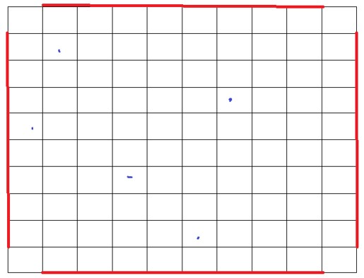

# Network-Simulation-Program

## 題目
1.	Minium(Threshold):強度夠的時候不切換(Pmin=100dB)
2.	Best_effort:訊號強者提供訊號
3.	Entropy:兩基地台訊號落差值超過閾值時候切換(閾值E=25dB)
4.	自行設定的algo.

根據這四個個別顯示以下題目環境中，車子訊號切換的次數(個別車或總和)  
再加上Call Service model，Model模式為:call、Release(訊號不會服務所以不會發生切換)、call、Release….。
* 平均一小時有2call
* 平均每個call時間為3mins
* 程式碼以Normal(又稱高斯) Distribution :N(μ, σ^2)來模擬。
(N(μ, σ^2)來模擬:意思是每通電話不是真的3分鐘整就會掛斷，他是一個分布Normal Distribution，也就是說不定會3分5秒通話也可能2分55之類的)

## 環境

1. 地圖:10x10，每格2.5km(也就是該map大小為25x25km)
2. 上圖，紅色線為車子可進入的點，總共為9x4=36的進入點。
=> 每個進入點出現車子進入的機率為P(n=1,t=1)，λ=5車/分=(1/12)/sec(看P(n,t)公式算)
3. 每個十字入口移動方向機率:  
(1) 前進:1/2  
(2) 迴轉:1/16  
(3) 左右轉:各7/32  
車速為:72km/hr=0.02km/sec.  
4. 基地台，上圖100格子建立時，每格都有1/10機率架設一座基地台，架設位置示意如上圖藍點。
5. 每個基地台都會以格子正中間，上下左右(各1/4機率)偏移0.1km
6. 每個基地台使用頻率(頻寬):[100,200,300….,1000]MHz(就是10選1，每個頻寬100)(Path Loss公式)
7. 基地台傳輸端發送功率Pt=120 dB
